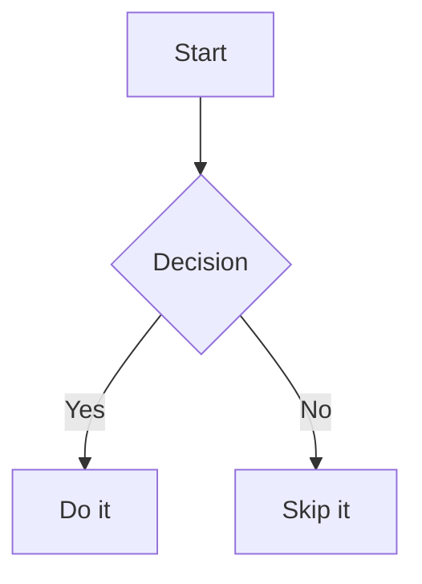

# Sample Document

This is a **print-ready** Markdown to PDF example using `md-pdf`.

> A blockquote to demonstrate typographic rhythm.

## Features

- Consistent typography and margins
- Tables, lists, and links
- Code blocks with syntax highlighting
- Mermaid diagrams and math

## Table

| Item      | Qty | Notes    |
| --------- | --- | -------- |
| Pens      | 3   | Blue ink |
| Notebooks | 2   | A5 size  |

## Code

```ts
export function add(a: number, b: number) {
	return a + b;
}
```

## Mermaid



## Math

Inline: $E = mc^2$

Block:

$$
\int_{0}^{\infty} e^{-x^2} dx = \frac{\sqrt{\pi}}{2}
$$

## Image


## Link

Visit [example.com](https://example.com).
