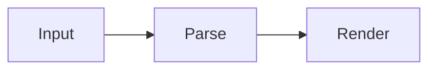

# V2 Sample

[[toc]]

This document includes footnotes, frontmatter, math, and mermaid.

## Footnotes

Here is a statement with a footnote.[^1]

[^1]: This is a footnote.

## Math

Inline: $a^2 + b^2 = c^2$

$$
\sum_{i=1}^{n} i = \frac{n(n+1)}{2}
$$

## Mermaid

